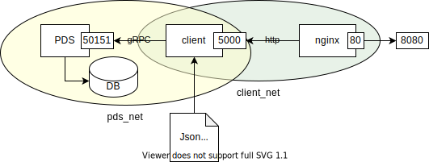

# Golang Microservice Test
This test is based on this [Assignment](test.description/README.md)
My solution composed of:
* 1 golang PDS microservice as required in the assignment
* 1 golang client service as required in the assignment
* 1 nginx reverse proxy (optinal)
* 1 PostgreSQL server (optional)




# Build and Run with docker-compose
### Prerequisites
* Install [docker-compose](https://docs.docker.com/compose/install/).
### Build and Run
1. build and run the package
   ```shell
   make build
   make run
   ```
1. Access:
   ```shell
   # Ping
   curl -v "http://localhost:8080/ping"

   # Get port description
   curl -v "http://localhost:8080/get?id=AEJED" | jq
   curl -v "http://localhost:8080/get?id=CNCGU" | jq


   # Browse list of ports
   curl -v "http://localhost:8080/list" | jq
   curl -v "http://localhost:8080/list?limit=5" | jq
   curl -v "http://localhost:8080/list?limit=5&offset=3" | jq
   ```

# Test
To run the [unit and functional test](test), run:
```shell
make test
```

# Local Build and Run
### Prerequisites
* [Go](https://golang.org/), any one of the **three latest major** [releases of Go](https://golang.org/doc/devel/release.html).
  For installation instructions, see Go’s [Getting Started](https://golang.org/doc/install).
* [Protocol buffer](https://developers.google.com/protocol-buffers) **compiler**, `protoc`, [version 3](https://developers.google.com/protocol-buffers/docs/proto3).
For installation instructions, see Protocol [Buffer Compiler Installation](https://grpc.io/docs/protoc-installation/).
* **Go plugins** for the protocol compiler:
  1. Install the protocol compiler plugins for Go using the following commands:
      ```shell
      $ export GO111MODULE=on  # Enable module mode
      $ go get google.golang.org/protobuf/cmd/protoc-gen-go \
               google.golang.org/grpc/cmd/protoc-gen-go-grpc
      ```
  1. Update your PATH so that the protoc compiler can find the plugins:
      ```shell
      $ export PATH="$PATH:$(go env GOPATH)/bin"
      ```
* [Docker](https://www.docker.com)

### Build and Run
from the *services* folder
```cd services```
1. compile the [.proto](testweb/testweb.proto)
   ```shell
   protoc --go_out=. --go_opt=paths=source_relative \
          --go-grpc_out=. --go-grpc_opt=paths=source_relative \
          proto_pds/pds.proto
   ```
1. Start the PostgreSQL server:
   ```shell
   docker run  -it --rm \
       --name my_psql \
       -p 15432:5432 \
       -e POSTGRES_PASSWORD=mysecretpassword \
       -v "$(pwd)/sql:/docker-entrypoint-initdb.d:ro" \
       postgres:13-alpine 
    
    # (optional) The sql server can be accessed with:
    PGPASSWORD=mysecretpassword psql -h 0 -p 15432  -U postgres

    # (optional) To terminate it run:
    docker stop my_psql
   ```
1. run on 2 terminals:
   ```shell
   # Terminal 1 - PortDomainService
   go run pds/cmd/backend/main.go

   # Terminal 2 - Client
   go run client/cmd/server/main.go -in ../test.description/ports.json
   ```
1. test:
   ```shell
   # Ping
   curl -v "http://localhost:5000/ping"

   # Get port description
   curl -v "http://localhost:5000/get?id=AEJED" | jq

   # Browse list of ports
   curl -v "http://localhost:5000/list" | jq
   curl -v "http://localhost:5000/list?limit=5" | jq
   curl -v "http://localhost:5000/list?limit=5&offset=3" | jq
   ```