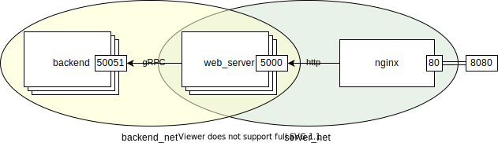

# Simple Web server Template with gRPC Backend, load balancing and nginx

This template use the basic http app from [Writing Web Applications](https://golang.org/doc/articles/wiki) and the example in [gRPC Quick Start](https://grpc.io/docs/languages/go/quickstart/#get-the-example-code).

It is composed of three docker images;
1. 3 [backend](backend) replicas, with a [gRPC](https://grpc.io/docs/languages/go/) interface to the port 50051
1. 3 [web_server](server) replicas, with a basic callback to http://localhost:8080/xxxxx which show a simple echo fetched from the [backend](backend) using [gRPC](https://grpc.io/docs/languages/go/)
1. A [nginx](nginx) reverse proxy to the [web_server](server)



# Build and Run with docker-compose
### Prerequisites
* Install [docker-compose](https://docs.docker.com/compose/install/).
### Build and Run
1. build and run the package
   ```shell
   make build
   make run
   ```
1. open: http://localhost:8080/webserver
   or: http://localhost:8080/test_webserver
   or use curl:
   ```shell
   curl "0:8080/webserver"
   curl "0:8080/test_webserver"
   ```

# Local Build and Run
### Prerequisites (from [gRPC Quick Start](https://grpc.io/docs/languages/go/quickstart/#prerequisites))
* [Go](https://golang.org/), any one of the **three latest major** [releases of Go](https://golang.org/doc/devel/release.html).
  For installation instructions, see Go’s [Getting Started](https://golang.org/doc/install).
* [Protocol buffer](https://developers.google.com/protocol-buffers) **compiler**, `protoc`, [version 3](https://developers.google.com/protocol-buffers/docs/proto3).
For installation instructions, see Protocol [Buffer Compiler Installation](https://grpc.io/docs/protoc-installation/).
* **Go plugins** for the protocol compiler:
  1. Install the protocol compiler plugins for Go using the following commands:
      ```shell
      $ export GO111MODULE=on  # Enable module mode
      $ go get google.golang.org/protobuf/cmd/protoc-gen-go \
               google.golang.org/grpc/cmd/protoc-gen-go-grpc
      ```
  1. Update your PATH so that the protoc compiler can find the plugins:
      ```shell
      $ export PATH="$PATH:$(go env GOPATH)/bin"
      ```
### Build and Run
1. compile the [.proto](testweb/testweb.proto)
   ```shell
   protoc --go_out=. --go_opt=paths=source_relative \
          --go-grpc_out=. --go-grpc_opt=paths=source_relative \
          testweb/testweb.proto
   ```
1. using 2 termianls run:
   ```shell
   # Term 1
   go run backend/main.go

   # Term 2
   go run server/main.go
   ```
1. open: http://localhost:5000/webserver
   or: http://localhost:5000/test_webserver
   or use curl:
   ```shell
   curl "0:5000/webserver"
   curl "0:5000/test_webserver"
   ```


