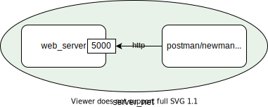

# HTTP server

## Summary
HTTP server that will accept any POST request (JSON) from multiple clients' websites.
This test is based on this [Assignment](test.description/README.md).

# Build and Run with docker-compose
### Prerequisites
* Install [docker-compose](https://docs.docker.com/compose/install/).
### Build and Run
1. build and run the package
   ```shell
   make build
   make run
   ```
1. open: http://localhost:8080
# Test
[golang Unit Testing](https://golangdocs.com/golang-unit-testing), [Postman/Newman](https://github.com/postmanlabs/newman) and [Robot](https://hub.docker.com/r/ppodgorsek/robot-framework/) are used to test this project.
Docker compose is used to automate the tests;
* [Unit tests](test/docker-compose.test.server.yml) are executed in the building image
* (API) [Newman tests](test/docker-compose.postman.test.yml) is executed in the same network:
* (UI) [Robot tests](test/docker-compose.robotframework.test.yml) use the same setup as the *Newman Test*.

  

To run the [tests](test), run:
```shell
make test
```
**Note:** Due to the lack of time, only some basic tests are performed
to improve the test coverage refer to [main_test.go](server/main_test.go), [postman_collection.json](test/postman/postman_collection.json) and [test.robot](test/robot/test.robot)


# Local Build and Run
### Prerequisites
* [Go](https://golang.org/), any one of the **three latest major** [releases of Go](https://golang.org/doc/devel/release.html).
  For installation instructions, see Go’s [Getting Started](https://golang.org/doc/install).

### Build and Run
1. run:
   ```shell
   go run server/main.go
   ```
1. open: http://localhost:5000/

### Test
3. run:
   ```
   go  test ./server/... -clientdir=$(pwd)/client
   ```


